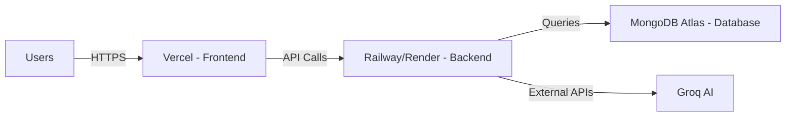

# Nowry Deployment Guide

**Last Updated:** December 30, 2024

This guide provides step-by-step instructions for deploying Nowry to production using free-tier services, perfect for beta testing and early launch phases.

---

## Table of Contents

1. [Architecture Overview](#architecture-overview)
2. [Prerequisites](#prerequisites)
3. [Database Setup (MongoDB Atlas)](#database-setup-mongodb-atlas)
4. [Backend Deployment (Railway/Render)](#backend-deployment)
5. [Frontend Deployment (Vercel)](#frontend-deployment)
6. [Environment Configuration](#environment-configuration)
7. [Post-Deployment Checklist](#post-deployment-checklist)
8. [Monitoring & Maintenance](#monitoring--maintenance)
9. [Scaling Strategy](#scaling-strategy)
10. [Troubleshooting](#troubleshooting)

---

## Architecture Overview



### Tech Stack

- **Frontend**: React 18 + Material-UI Joy + Lexical Editor
- **Backend**: FastAPI (Python) + Motor (async MongoDB driver)
- **Database**: MongoDB with GridFS for file storage
- **AI Services**: Groq (LangChain integration)

---

## Prerequisites

Before starting, ensure you have:

- [ ] GitHub account (for code hosting and CI/CD)
- [ ] Domain name (optional but recommended - can use free subdomains initially)
- [ ] Access to the following email for verification:
  - MongoDB Atlas
  - Vercel
  - Railway/Render
- [ ] Groq API key ([get it here](https://console.groq.com))

---

## Database Setup (MongoDB Atlas)

MongoDB Atlas offers a generous **free tier (M0)** with 512MB storage - perfect for beta testing.

### Step 1: Create MongoDB Atlas Account

1. Go to [MongoDB Atlas](https://www.mongodb.com/cloud/atlas)
2. Sign up with your email or GitHub account
3. Create a new organization (e.g., "Nowry")

### Step 2: Create a Free Cluster

1. Click **"Build a Database"**
2. Select **"M0 Free"** tier
3. Choose a cloud provider & region closest to your users
   - AWS: `us-east-1` (N. Virginia) or `eu-west-1` (Ireland)
   - Recommended: Same region as your backend deployment
4. Name your cluster: `nowry-beta`
5. Click **"Create"**

### Step 3: Configure Database Access

1. Navigate to **Database Access** (Security tab)
2. Click **"Add New Database User"**
   - Authentication Method: **Password**
   - Username: `nowry-admin`
   - Password: Generate a secure password (save it for later)
   - Built-in Role: **Read and write to any database**
3. Click **"Add User"**

### Step 4: Configure Network Access

1. Navigate to **Network Access** (Security tab)
2. Click **"Add IP Address"**
3. Click **"Allow Access from Anywhere"** (for now)
   - IP: `0.0.0.0/0`
   - ⚠️ **Note**: For production, restrict this to your backend server IPs
4. Click **"Confirm"**

### Step 5: Get Connection String

1. Go to **Database** → **Connect**
2. Click **"Drivers"**
3. Select **Driver**: Python, **Version**: 3.12 or later
4. Copy the connection string:
   ```
   mongodb+srv://nowry-admin:<password>@nowry-beta.xxxxx.mongodb.net/?retryWrites=true&w=majority
   ```
5. Replace `<password>` with your actual database password
6. **Save this for environment variables**

### Step 6: Create Database & Collections

MongoDB will auto-create collections when your backend first writes data, but you can manually create them:

1. Go to **Database** → **Browse Collections**
2. Click **"Add My Own Data"**
3. Database name: `nowry_db`
4. Create these collections:
   - `users`
   - `books`
   - `pages`
   - `study_cards`
   - `quizzes`
   - `news`
   - `subscriptions`

---

## Backend Deployment

We'll use **Railway** (recommended) or **Render** - both offer free tiers.

### Option A: Railway (Recommended)

Railway offers $5/month free credit - enough for small projects.

#### Step 1: Sign Up

1. Go to [Railway.app](https://railway.app)
2. Sign in with GitHub

#### Step 2: Create New Project

1. Click **"New Project"**
2. Select **"Deploy from GitHub repo"**
3. Authorize Railway to access your repository
4. Select your `Nowry-API` repository
5. Railway will auto-detect it as a Python project

#### Step 3: Configure Build

1. Railway should auto-detect `requirements.txt`
2. If not, add these settings manually:
   - **Build Command**: `pip install -r requirements.txt`
   - **Start Command**: `uvicorn app.main:app --host 0.0.0.0 --port $PORT`

#### Step 4: Add Environment Variables

Click **Variables** tab and add:

```env
# Database
MONGO_URI=mongodb+srv://nowry-admin:<password>@nowry-beta.xxxxx.mongodb.net/nowry_db?retryWrites=true&w=majority

# API Keys
GROQ_API_KEY=your_groq_api_key_here

# Security
SECRET_KEY=generate_a_random_32_char_string_here
ALGORITHM=HS256
ACCESS_TOKEN_EXPIRE_MINUTES=30

# CORS (Update after frontend deployment)
ALLOWED_ORIGINS=*

# Environment
ENV=production
```

> **Important**: Setting `ENV=production` enables `Secure` cookies, which **REQUIRE** an HTTPS connection. Your app (frontend and backend) MUST be served over HTTPS in production, or login will fail.


> **Generate SECRET_KEY**: Run `python -c "import secrets; print(secrets.token_urlsafe(32))"`

#### Step 5: Deploy

1. Click **"Deploy"**
2. Wait for build to complete (~3-5 minutes)
3. Railway will provide a public URL: `https://your-backend.railway.app`
4. **Save this URL** for frontend configuration

#### Step 6: Enable HealthCheck (Optional)

Add a health endpoint in your FastAPI app:

```python
@app.get("/health")
async def health():
    return {"status": "healthy"}
```

Configure in Railway:
- **Settings** → **Healthcheck Path**: `/health`

---

### Option B: Render

Render offers a free tier with 750 hours/month.

#### Step 1: Sign Up

1. Go to [Render.com](https://render.com)
2. Sign up with GitHub

#### Step 2: Create Web Service

1. Click **"New +"** → **"Web Service"**
2. Connect your `Nowry-API` repository
3. Configuration:
   - **Name**: `nowry-backend`
   - **Region**: Choose closest to your users
   - **Branch**: `main`
   - **Runtime**: `Python 3`
   - **Build Command**: `pip install -r requirements.txt`
   - **Start Command**: `uvicorn app.main:app --host 0.0.0.0 --port $PORT`
   - **Instance Type**: **Free**

#### Step 3: Add Environment Variables

Same as Railway (see above)

#### Step 4: Deploy

Click **"Create Web Service"** - deployment takes ~5-10 minutes.

Your backend URL: `https://nowry-backend.onrender.com`

> ⚠️ **Free tier limitation**: Render spins down after 15 minutes of inactivity. First request after sleep takes ~30 seconds.

---

## Frontend Deployment

### Vercel (Recommended)

Vercel is optimized for React apps and offers generous free tier.

#### Step 1: Sign Up

1. Go to [Vercel.com](https://vercel.com)
2. Sign up with GitHub

#### Step 2: Import Project

1. Click **"Add New..."** → **"Project"**
2. Import your `nowry` (frontend) repository
3. Vercel auto-detects Create React App

#### Step 3: Configure Build Settings

- **Framework Preset**: Create React App
- **Build Command**: `npm run build`
- **Output Directory**: `build`
- **Install Command**: `npm install`

#### Step 4: Add Environment Variables

Click **"Environment Variables"** and add:

```env
REACT_APP_API_URL=https://your-backend.railway.app
```

Replace with your actual backend URL from previous step.

#### Step 5: Deploy

1. Click **"Deploy"**
2. Wait for build (~2-3 minutes)
3. Vercel provides URL: `https://nowry.vercel.app`
4. Optionally add custom domain later

#### Step 6: Update Backend CORS

Go back to Railway/Render and update `ALLOWED_ORIGINS`:

```env
ALLOWED_ORIGINS=https://nowry.vercel.app,http://localhost:3000
```

Redeploy backend if needed.

---

## Environment Configuration

### Frontend (.env)

Create `/nowry/.env.production`:

```env
# API Configuration
REACT_APP_API_URL=https://your-backend.railway.app
REACT_APP_VERSION=1.0.0-beta

# Feature Flags (optional)
REACT_APP_ENABLE_ANALYTICS=false
REACT_APP_ENABLE_PAYMENT=false
```

### Backend (.env)

Already configured in Railway/Render dashboard, but for local development:

```env
# Database
MONGO_URI=mongodb+srv://...

# API Keys
GROQ_API_KEY=gsk_...

# Security
SECRET_KEY=...
ALGORITHM=HS256
ACCESS_TOKEN_EXPIRE_MINUTES=30

# CORS
ALLOWED_ORIGINS=https://nowry.vercel.app,http://localhost:3000

# Environment
ENV=development
```

---

## Post-Deployment Checklist

- [ ] **Test user registration** on production URL
- [ ] **Test book import** with sample PDF
- [ ] **Test AI features** (card generation, summarization)
- [ ] **Verify file uploads** work correctly
- [ ] **Check all pages** are accessible
- [ ] **Test on mobile devices**
- [ ] **Monitor initial logs** for errors
- [ ] **Setup error tracking** (Optional: Sentry)
- [ ] **Enable HTTPS** (auto on Vercel/Railway)
- [ ] **Add custom domain** (optional)

---

## Monitoring & Maintenance

### Free Monitoring Tools

#### 1. **Railway/Render Logs**
- Check **Logs tab** for backend errors
- Set up log drains if needed

#### 2. **MongoDB Atlas Monitoring**
- Dashboard shows:
  - Connection count
  - Storage usage
  - Query performance
- Set up **Alerts** (free):
  - Storage >80%
  - Connections >40

#### 3. **Vercel Analytics**
- Free tier includes:
  - Page views
  - Build status
  - Performance metrics

#### 4. **UptimeRobot** (Optional)
- Free tier: Monitor 50 endpoints
- Get alerts when services go down
- Setup:
  1. Add your backend health endpoint
  2. Add your frontend URL
  3. Set check interval: 5 minutes

### Recommended Alerts

Set these up in your platforms:

- **MongoDB**: Storage > 400MB (80% of free tier)
- **Railway**: Credits < $1 remaining
- **Backend**: Response time > 2s
- **Frontend**: Build failures

---

## Scaling Strategy

### When to Upgrade (Metrics to Watch)

| Metric | Free Tier Limit | Action Needed |
|--------|----------------|---------------|
| **MongoDB Storage** | 512MB | Upgrade to M10 ($0.08/hr) |
| **Concurrent Users** | ~50-100 | Upgrade backend to paid tier |
| **API Requests** | ~1M/month | Consider caching layer |
| **Railway Credits** | $5/month | Upgrade to paid ($5/month+) |

### Growth Path

#### Phase 1: Beta (0-100 users) - **FREE**
- MongoDB: M0 (512MB)
- Railway: Free tier ($5 credit)
- Vercel: Free tier
- **Total Cost**: $0/month

#### Phase 2: Early Launch (100-1K users) - **~$15/month**
- MongoDB: M10 (2GB) - ~$10/month
- Railway: Hobby ($5/month)
- Vercel: Free tier
- **Total Cost**: ~$15/month

#### Phase 3: Growth (1K-10K users) - **~$50/month**
- MongoDB: M20 (10GB) - ~$25/month
- Railway: Pro ($20/month) or migrate to AWS
- Vercel: Pro ($20/month)
- Add: Redis cache (Upstash free tier)
- **Total Cost**: ~$50-70/month

### Optimization Tips

1. **Enable MongoDB Compression**
   - Reduces storage by ~30%
   - No code changes needed

2. **Implement Caching**
   - Use Redis (Upstash free tier: 10K requests/day)
   - Cache frequently accessed data

3. **Optimize Images**
   - Use WebP format
   - Implement lazy loading

4. **Database Indexing**
   ```javascript
   // Add indexes for common queries
   db.users.createIndex({ email: 1 })
   db.books.createIndex({ user_id: 1, created_at: -1 })
   db.pages.createIndex({ book_id: 1, page_number: 1 })
   ```

5. **Enable CDN**
   - Vercel includes global CDN
   - Serves static assets from edge

---

## Troubleshooting

### Common Issues

#### 1. **Backend not responding**

**Symptoms**: Frontend can't connect to API

**Solutions**:
- Check Railway/Render logs for errors
- Verify MONGO_URI is correct
- Check if service is running (may need to wake from sleep on Render)
- Verify CORS configuration

```bash
# Test backend health
curl https://your-backend.railway.app/health
```

#### 2. **CORS errors**

**Error**: `Access to fetch blocked by CORS policy`

**Solution**:
```python
# In backend app/main.py
from fastapi.middleware.cors import CORSMiddleware

app.add_middleware(
    CORSMiddleware,
    allow_origins=["https://nowry.vercel.app"],
    allow_credentials=True,
    allow_methods=["*"],
    allow_headers=["*"],
)
```

#### 3. **Database connection timeout**

**Error**: `ServerSelectionTimeoutError`

**Solutions**:
- Verify MONGO_URI format
- Check MongoDB Atlas Network Access (IP whitelist)
- Ensure database user has correct permissions

#### 4. **Build failures on Vercel**

**Solutions**:
- Check build logs for specific errors
- Verify all dependencies in `package.json`
- Clear build cache: Settings → Clear cache

#### 5. **File upload failures**

**Solutions**:
- Check GridFS is enabled in MongoDB
- Verify file size limits (default: 16MB)
- Check backend logs for storage errors

---

## Security Best Practices

### Pre-Launch Checklist

- [ ] Environment variables are not committed to git
- [ ] SECRET_KEY is unique and secure (32+ characters)
- [ ] MongoDB uses strong password (20+ chars)
- [ ] HTTPS is enabled (automatic on Vercel/Railway)
- [ ] File upload size limits are enforced
- [ ] Input validation on all endpoints
- [ ] Rate limiting configured (optional for beta)

### Recommended Security Headers

Add to your backend:

```python
@app.middleware("http")
async def security_headers(request, call_next):
    response = await call_next(request)
    response.headers["X-Content-Type-Options"] = "nosniff"
    response.headers["X-Frame-Options"] = "DENY"
    response.headers["X-XSS-Protection"] = "1; mode=block"
    return response
```

---

## Cost Breakdown

### Free Tier Setup (0-100 users)

| Service | Plan | Cost | Limits |
|---------|------|------|--------|
| MongoDB Atlas | M0 | $0 | 512MB storage |
| Railway | Free | $0 | $5 credit/month |
| Vercel | Hobby | $0 | 100GB bandwidth |
| Groq API | Free | $0 | Rate limited |
| **TOTAL** | | **$0/mo** | |

### Estimated Costs After Growth

- **100-1K users**: ~$15-20/month
- **1K-10K users**: ~$50-100/month
- **10K+ users**: Depends on usage, ~$200+/month

---

## Additional Resources

- [FastAPI Deployment Docs](https://fastapi.tiangolo.com/deployment/)
- [MongoDB Atlas Documentation](https://www.mongodb.com/docs/atlas/)
- [Vercel Documentation](https://vercel.com/docs)
- [Railway Documentation](https://docs.railway.app/)

---

## Support & Updates

For issues with deployment:
1. Check this guide first
2. Review platform-specific logs
3. Check GitHub Issues
4. Contact platform support (all have free tier support)

**Next Steps**: See [MONITORING.md](./MONITORING.md) for production monitoring setup.
