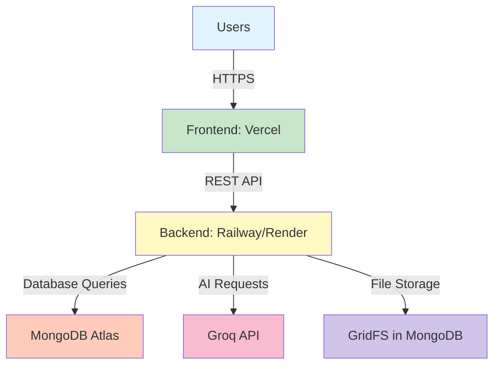

# Nowry Deployment Documentation

Welcome to the Nowry deployment documentation! This guide will help you deploy and scale your application from beta testing to production.

## 📚 Documentation Index

### Getting Started

1. **[Quick Deploy Guide](./QUICK_DEPLOY.md)** ⚡
   - 30-minute deployment walkthrough
   - Perfect for quick setup
   - Free tier only
   - **Start here if you want to deploy NOW**

2. **[Full Deployment Guide](./DEPLOYMENT_GUIDE.md)** 📖
   - Comprehensive step-by-step instructions
   - Covers all hosting platforms
   - Troubleshooting section
   - Best practices included

### Configuration & Scaling

3. **[Environment Variables Reference](./ENVIRONMENT_VARIABLES.md)** 🔐
   - Complete list of all environment variables
   - Security best practices
   - Platform-specific instructions
   - Validation scripts

4. **[Infrastructure Guide](./INFRASTRUCTURE.md)** 🏗️
   - Scaling strategies
   - Docker configurations
   - Kubernetes setup (advanced)
   - Cost optimization tips
   - Migration paths

## 🚀 Quick Links

| What you need | Where to go |
|---------------|-------------|
| Deploy in 30 minutes | [Quick Deploy](./QUICK_DEPLOY.md) |
| Detailed setup instructions | [Deployment Guide](./DEPLOYMENT_GUIDE.md) |
| Configure environment variables | [Environment Variables](./ENVIRONMENT_VARIABLES.md) |
| Scale beyond free tier | [Infrastructure](./INFRASTRUCTURE.md) |
| Fix deployment issues | [Troubleshooting](#troubleshooting) |

## 🎯 Deployment Paths

### Path 1: Beta Testing (Free Tier)
**For: 0-100 users | Cost: $0/month**

```
1. Read Quick Deploy Guide
2. Setup MongoDB Atlas (Free M0)
3. Deploy Backend to Railway
4. Deploy Frontend to Vercel
5. Configure environment variables
6. Test & launch!
```

→ **Start**: [Quick Deploy](./QUICK_DEPLOY.md)

### Path 2: Growing Application
**For: 100-1K users | Cost: ~$15/month**

```
1. Follow Full Deployment Guide
2. Upgrade MongoDB to M10
3. Add monitoring (UptimeRobot)
4. Implement caching layer
5. Optimize database queries
```

→ **Start**: [Deployment Guide](./DEPLOYMENT_GUIDE.md) → [Infrastructure](./INFRASTRUCTURE.md)

### Path 3: Production Scale
**For: 1K+ users | Cost: $50+/month**

```
1. Review Infrastructure Guide
2. Implement Docker containers
3. Setup CI/CD pipelines
4. Add Redis caching
5. Consider AWS/GCP migration
```

→ **Start**: [Infrastructure](./INFRASTRUCTURE.md)

## 🏗️ Architecture Overview



## 📊 Cost Breakdown

### Free Tier (0-100 users)
| Service | Plan | Cost | What you get |
|---------|------|------|--------------|
| MongoDB Atlas | M0 | $0 | 512MB storage |
| Railway | Free | $0 | $5 credit/month |
| Vercel | Hobby | $0 | Unlimited deployments |
| Groq API | Free | $0 | Rate limited |
| **Total** | | **$0/mo** | Perfect for beta! |

### Paid Tier (100-1K users)
| Service | Plan | Cost |
|---------|------|------|
| MongoDB Atlas | M10 | ~$10 |
| Railway | Hobby | $5 |
| Vercel | Free | $0 |
| **Total** | | **~$15/mo** |

### Growth Tier (1K-10K users)
| Service | Plan | Cost |
|---------|------|------|
| MongoDB Atlas | M20 | ~$25 |
| Railway | Pro | $20 |
| Vercel | Pro | $20 |
| Redis Cache | Upstash | $0-10 |
| **Total** | | **~$65-75/mo** |

## ⚙️ Tech Stack

### Frontend
- **Framework**: React 18
- **UI Library**: Material-UI Joy
- **Editor**: Lexical (Rich Text)
- **Routing**: React Router v6
- **State**: React Hooks + Context
- **Build**: Create React App

### Backend
- **Framework**: FastAPI (Python)
- **Database Driver**: Motor (async MongoDB)
- **Auth**: JWT tokens
- **AI Integration**: LangChain + Groq
- **File Processing**: PyPDF2, python-docx

### Database
- **Primary**: MongoDB Atlas
- **File Storage**: GridFS
- **Cache** (optional): Redis

## 🛠️ Prerequisites

Before deploying, ensure you have:

- [ ] GitHub account
- [ ] Email for service signups
- [ ] Groq API key ([get free key](https://console.groq.com))
- [ ] Basic knowledge of:
  - Git/GitHub
  - Environment variables
  - Command line basics

## 🚨 Common Issues & Solutions

### Backend not responding
**Issue**: Frontend can't connect to API

**Quick Fix**:
1. Check backend logs (Railway/Render dashboard)
2. Verify `MONGO_URI` is correct
3. Update `ALLOWED_ORIGINS` with your frontend URL
4. Check if backend service is running

→ [Full Troubleshooting Guide](./DEPLOYMENT_GUIDE.md#troubleshooting)

### CORS errors
**Issue**: `Access to fetch blocked by CORS policy`

**Quick Fix**:
```env
# In your backend environment variables
ALLOWED_ORIGINS=https://your-frontend.vercel.app
```

### Build failures
**Issue**: Vercel or Railway build fails

**Quick Fix**:
1. Check build logs for specific error
2. Verify `package.json` / `requirements.txt`
3. Clear build cache
4. Check Node/Python version compatibility

## 📈 Performance Benchmarks

Expected performance on free tier:

| Metric | Free Tier | Paid Tier (M10) |
|--------|-----------|-----------------|
| API Response Time | 200-500ms | 100-200ms |
| Page Load | 1-2s | 0.5-1s |
| File Upload (10MB) | 10-15s | 5-8s |
| AI Generation | 2-5s | 2-5s (same) |
| Concurrent Users | ~50 | ~500 |

## 🔒 Security Checklist

Before launching:

- [ ] All secrets in environment variables (not in code)
- [ ] `SECRET_KEY` is strong & unique (32+ chars)
- [ ] MongoDB password is strong
- [ ] HTTPS enabled (automatic on Vercel/Railway)
- [ ] CORS restricted to your domain
- [ ] File upload size limits enforced
- [ ] Input validation on all endpoints
- [ ] Rate limiting configured (optional for beta)

→ [Full Security Guide](./ENVIRONMENT_VARIABLES.md#security-best-practices)

## 📞 Support Resources

### Platform Documentation
- [MongoDB Atlas Docs](https://www.mongodb.com/docs/atlas/)
- [Railway Docs](https://docs.railway.app/)
- [Vercel Docs](https://vercel.com/docs)
- [FastAPI Docs](https://fastapi.tiangolo.com/)

### Community
- GitHub Issues (for this project)
- Railway Discord
- MongoDB Community Forums
- FastAPI Discord

## 🗺️ Deployment Roadmap

### Phase 1: Initial Deployment (Week 1)
- [ ] Setup MongoDB Atlas
- [ ] Deploy backend to Railway
- [ ] Deploy frontend to Vercel
- [ ] Configure environment variables
- [ ] Test basic functionality

### Phase 2: User Testing (Weeks 2-4)
- [ ] Invite beta testers
- [ ] Monitor error logs
- [ ] Gather feedback
- [ ] Fix critical bugs
- [ ] Optimize performance

### Phase 3: Scaling (Month 2+)
- [ ] Monitor usage metrics
- [ ] Upgrade services as needed
- [ ] Add caching layer
- [ ] Implement CI/CD
- [ ] Setup monitoring alerts

## 📝 Next Steps

1. **New to deployment?**
   → Start with [Quick Deploy](./QUICK_DEPLOY.md)

2. **Want detailed setup?**
   → Follow [Full Deployment Guide](./DEPLOYMENT_GUIDE.md)

3. **Ready to scale?**
   → Check [Infrastructure Guide](./INFRASTRUCTURE.md)

4. **Need environment vars?**
   → See [Environment Variables](./ENVIRONMENT_VARIABLES.md)

## 🎓 Additional Resources

- [Docker Setup](./INFRASTRUCTURE.md#docker-configuration)
- [CI/CD Pipeline](./INFRASTRUCTURE.md#cicd-pipeline)
- [Monitoring Setup](./DEPLOYMENT_GUIDE.md#monitoring--maintenance)
- [Cost Optimization](./INFRASTRUCTURE.md#cost-optimization-tips)

---

**Happy Deploying! 🚀**

*Last updated: December 30, 2024*
