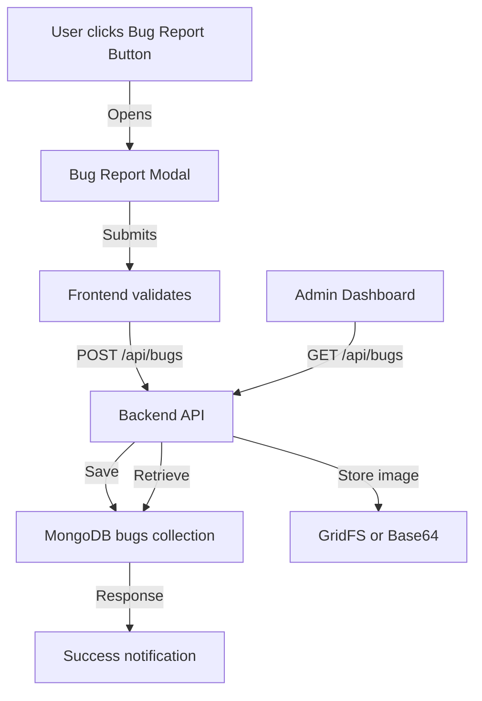

# Bug Reporting System - Implementation Plan

**Status**: 📝 Planning  
**Priority**: High (Beta Testing Critical)  
**Estimated Time**: 4-6 hours  
**Last Updated**: December 30, 2024

---

## Overview

Implement a comprehensive bug reporting system for beta testers with:
- Easy-to-access report button in UI header
- Screenshot attachment capability
- Beta tester subscription tier with unlimited access
- Minimalist bug report modal
- Backend storage and management

---

## User Stories

### As a Beta Tester
- I want to quickly report bugs I encounter
- I want to attach screenshots to show the issue
- I want to provide context (steps to reproduce, severity, etc.)
- I want to see my submitted bug reports

### As an Admin/Developer
- I want to view all bug reports with details
- I want to filter by status, severity, and date
- I want to mark bugs as resolved
- I want to see attached screenshots

---

## Architecture



---

## Database Schema

### Bug Reports Collection

```javascript
// bugs collection
{
  _id: ObjectId,
  user_id: ObjectId,              // Reference to users
  title: String,                  // Short bug title
  description: String,            // Detailed description
  steps_to_reproduce: String,     // How to reproduce
  expected_behavior: String,      // What should happen
  actual_behavior: String,        // What actually happened
  severity: String,               // 'critical', 'high', 'medium', 'low'
  category: String,               // 'ui', 'functionality', 'performance', 'other'
  url: String,                    // Page where bug occurred
  browser_info: {
    name: String,                 // Chrome, Firefox, Safari
    version: String,
    os: String,                   // Operating system
    screen_resolution: String
  },
  screenshots: [                  // Array of screenshot references
    {
      filename: String,
      data: String,               // Base64 or GridFS reference
      uploaded_at: Date
    }
  ],
  status: String,                 // 'open', 'in-progress', 'resolved', 'closed'
  priority: String,               // Set by admin
  assigned_to: String,            // Developer assigned
  tags: [String],                 // ['login', 'editor', 'mobile']
  created_at: Date,
  updated_at: Date,
  resolved_at: Date,              // When marked as resolved
  admin_notes: String             // Internal notes
}
```

### User Model Update

Add beta tester flag to existing users collection:

```javascript
// Add to users collection
{
  // ... existing fields
  subscription_type: String,      // 'free', 'beta', 'premium', 'pro'
  beta_features: {
    enabled: Boolean,             // Default: false
    unlimited_books: Boolean,
    unlimited_ai_requests: Boolean,
    bug_reporting: Boolean,
    priority_support: Boolean
  },
  beta_enrolled_at: Date
}
```

---

## Image Storage Strategy

### Recommended: Base64 (for simplicity in beta)

**Pros**:
- Simple implementation
- No additional infrastructure
- Easy to retrieve and display
- Works well for beta (limited users)

**Cons**:
- Larger database storage (~33% overhead)
- Not ideal for large scale

**Implementation**:
```javascript
// Store compressed, max 500KB per image
const MAX_IMAGE_SIZE = 500 * 1024 // 500KB
const compressedBase64 = compressImage(originalImage, MAX_IMAGE_SIZE)
```

### Alternative: GridFS (for production scaling)

**Pros**:
- Efficient for large files
- Scalable
- Streaming support

**Cons**:
- More complex implementation
- Requires GridFS setup

**Recommendation**: Start with Base64, migrate to GridFS if needed.

---

## API Endpoints

### Bug Management

```python
# /Nowry-API/app/routers/bugs.py

# Public Endpoints (Beta Testers)
POST   /api/bugs                  # Submit bug report
GET    /api/bugs/my-reports       # Get user's bug reports
GET    /api/bugs/{bug_id}         # Get specific bug details
PATCH  /api/bugs/{bug_id}         # Update own bug report
DELETE /api/bugs/{bug_id}         # Delete own bug report

# Admin Endpoints (Requires admin role)
GET    /api/bugs                  # List all bugs (with filters)
GET    /api/bugs/stats            # Bug statistics
PATCH  /api/bugs/{bug_id}/status  # Update bug status
PATCH  /api/bugs/{bug_id}/assign  # Assign to developer
POST   /api/bugs/{bug_id}/notes   # Add admin notes
```

### Request/Response Examples

#### Submit Bug Report
```json
// POST /api/bugs
{
  "title": "Editor crashes when pasting large content",
  "description": "The editor freezes and crashes when I paste content larger than 10 pages",
  "steps_to_reproduce": "1. Open editor\n2. Copy large document\n3. Paste into editor",
  "expected_behavior": "Content should paste smoothly",
  "actual_behavior": "Editor freezes for 5 seconds then crashes",
  "severity": "high",
  "category": "functionality",
  "url": "/books/123/edit",
  "browser_info": {
    "name": "Chrome",
    "version": "120.0.0",
    "os": "macOS",
    "screen_resolution": "1920x1080"
  },
  "screenshots": [
    {
      "filename": "crash-screenshot.png",
      "data": "data:image/png;base64,iVBORw0KGgoAAAANS..."
    }
  ]
}

// Response
{
  "bug_id": "65abc123def456...",
  "message": "Bug report submitted successfully",
  "status": "open",
  "created_at": "2024-12-30T21:53:19Z"
}
```

---

## Frontend Implementation

### 1. Bug Report Modal Component

**Location**: `/nowry/src/components/Bugs/BugReportModal.js`

```javascript
import React, { useState } from 'react'
import { Modal, ModalDialog, ModalClose, Stack, Input, Textarea, Select, Button, FormLabel } from '@mui/joy'
import { Bug, Upload, X } from 'lucide-react'

export default function BugReportModal({ open, onClose, onSubmit }) {
  const [formData, setFormData] = useState({
    title: '',
    description: '',
    steps_to_reproduce: '',
    expected_behavior: '',
    actual_behavior: '',
    severity: 'medium',
    category: 'functionality',
    screenshots: []
  })
  
  const [loading, setLoading] = useState(false)
  
  const handleScreenshotUpload = async (e) => {
    const file = e.target.files[0]
    if (!file) return
    
    // Compress and convert to base64
    const base64 = await compressAndConvert(file)
    setFormData(prev => ({
      ...prev,
      screenshots: [...prev.screenshots, {
        filename: file.name,
        data: base64
      }]
    }))
  }
  
  const handleSubmit = async () => {
    setLoading(true)
    try {
      // Capture browser info automatically
      const browserInfo = getBrowserInfo()
      
      await onSubmit({
        ...formData,
        url: window.location.pathname,
        browser_info: browserInfo
      })
      
      onClose()
      // Show success notification
    } catch (error) {
      console.error('Failed to submit bug report:', error)
    } finally {
      setLoading(false)
    }
  }
  
  return (
    <Modal open={open} onClose={onClose}>
      <ModalDialog sx={{ width: 600, maxHeight: '90vh', overflow: 'auto' }}>
        <ModalClose />
        
        <Stack spacing={2}>
          <div style={{ display: 'flex', alignItems: 'center', gap: 8 }}>
            <Bug size={24} />
            <h2>Report a Bug</h2>
          </div>
          
          {/* Title */}
          <div>
            <FormLabel>Bug Title *</FormLabel>
            <Input
              placeholder="Brief description of the issue"
              value={formData.title}
              onChange={(e) => setFormData({ ...formData, title: e.target.value })}
              required
            />
          </div>
          
          {/* Description */}
          <div>
            <FormLabel>Description *</FormLabel>
            <Textarea
              placeholder="Detailed description of the bug"
              minRows={3}
              value={formData.description}
              onChange={(e) => setFormData({ ...formData, description: e.target.value })}
              required
            />
          </div>
          
          {/* Steps to Reproduce */}
          <div>
            <FormLabel>Steps to Reproduce</FormLabel>
            <Textarea
              placeholder="1. Go to...\n2. Click on...\n3. See error"
              minRows={3}
              value={formData.steps_to_reproduce}
              onChange={(e) => setFormData({ ...formData, steps_to_reproduce: e.target.value })}
            />
          </div>
          
          {/* Expected vs Actual */}
          <Stack direction="row" spacing={2}>
            <div style={{ flex: 1 }}>
              <FormLabel>Expected Behavior</FormLabel>
              <Textarea
                placeholder="What should happen?"
                minRows={2}
                value={formData.expected_behavior}
                onChange={(e) => setFormData({ ...formData, expected_behavior: e.target.value })}
              />
            </div>
            <div style={{ flex: 1 }}>
              <FormLabel>Actual Behavior</FormLabel>
              <Textarea
                placeholder="What actually happened?"
                minRows={2}
                value={formData.actual_behavior}
                onChange={(e) => setFormData({ ...formData, actual_behavior: e.target.value })}
              />
            </div>
          </Stack>
          
          {/* Severity & Category */}
          <Stack direction="row" spacing={2}>
            <div style={{ flex: 1 }}>
              <FormLabel>Severity</FormLabel>
              <Select
                value={formData.severity}
                onChange={(e, value) => setFormData({ ...formData, severity: value })}
              >
                <option value="low">Low</option>
                <option value="medium">Medium</option>
                <option value="high">High</option>
                <option value="critical">Critical</option>
              </Select>
            </div>
            <div style={{ flex: 1 }}>
              <FormLabel>Category</FormLabel>
              <Select
                value={formData.category}
                onChange={(e, value) => setFormData({ ...formData, category: value })}
              >
                <option value="ui">UI/Design</option>
                <option value="functionality">Functionality</option>
                <option value="performance">Performance</option>
                <option value="other">Other</option>
              </Select>
            </div>
          </Stack>
          
          {/* Screenshot Upload */}
          <div>
            <FormLabel>Screenshots (Optional)</FormLabel>
            <Button
              component="label"
              variant="outlined"
              startDecorator={<Upload size={16} />}
            >
              Upload Screenshot
              <input
                type="file"
                hidden
                accept="image/*"
                onChange={handleScreenshotUpload}
              />
            </Button>
            
            {formData.screenshots.length > 0 && (
              <Stack spacing={1} sx={{ mt: 1 }}>
                {formData.screenshots.map((screenshot, idx) => (
                  <div key={idx} style={{ display: 'flex', alignItems: 'center', gap: 8 }}>
                    <span>{screenshot.filename}</span>
                    <Button
                      size="sm"
                      variant="plain"
                      color="danger"
                      onClick={() => {
                        setFormData({
                          ...formData,
                          screenshots: formData.screenshots.filter((_, i) => i !== idx)
                        })
                      }}
                    >
                      <X size={14} />
                    </Button>
                  </div>
                ))}
              </Stack>
            )}
          </div>
          
          {/* Submit Button */}
          <Button
            fullWidth
            onClick={handleSubmit}
            loading={loading}
            disabled={!formData.title || !formData.description}
          >
            Submit Bug Report
          </Button>
        </Stack>
      </ModalDialog>
    </Modal>
  )
}

// Helper functions
function getBrowserInfo() {
  const ua = navigator.userAgent
  return {
    name: getBrowserName(ua),
    version: getBrowserVersion(ua),
    os: getOS(ua),
    screen_resolution: `${window.screen.width}x${window.screen.height}`
  }
}

async function compressAndConvert(file) {
  // Implement image compression and base64 conversion
  return new Promise((resolve) => {
    const reader = new FileReader()
    reader.onload = (e) => {
      const img = new Image()
      img.onload = () => {
        const canvas = document.createElement('canvas')
        const MAX_WIDTH = 1200
        const MAX_HEIGHT = 800
        
        let width = img.width
        let height = img.height
        
        if (width > height) {
          if (width > MAX_WIDTH) {
            height *= MAX_WIDTH / width
            width = MAX_WIDTH
          }
        } else {
          if (height > MAX_HEIGHT) {
            width *= MAX_HEIGHT / height
            height = MAX_HEIGHT
          }
        }
        
        canvas.width = width
        canvas.height = height
        const ctx = canvas.getContext('2d')
        ctx.drawImage(img, 0, 0, width, height)
        
        resolve(canvas.toDataURL('image/jpeg', 0.7))
      }
      img.src = e.target.result
    }
    reader.readAsDataURL(file)
  })
}
```

### 2. Header Integration

**Location**: Update existing header component (e.g., `/nowry/src/components/User/Home/Header.js` or similar)

```javascript
import { Bug } from 'lucide-react'
import BugReportModal from '../Bugs/BugReportModal'

// Add state
const [bugReportOpen, setBugReportOpen] = useState(false)

// Add button to header
<IconButton
  variant="soft"
  color="warning"
  onClick={() => setBugReportOpen(true)}
  title="Report a Bug"
>
  <Bug size={20} />
</IconButton>

// Add modal
<BugReportModal
  open={bugReportOpen}
  onClose={() => setBugReportOpen(false)}
  onSubmit={handleBugSubmit}
/>
```

### 3. API Service

**Location**: `/nowry/src/api/services/bugs.service.js`

```javascript
import apiClient from '../client/apiClient'

export const bugsService = {
  // Submit bug report
  submitBug: async (bugData) => {
    const response = await apiClient.post('/bugs', bugData)
    return response.data
  },
  
  // Get user's bug reports
  getMyReports: async () => {
    const response = await apiClient.get('/bugs/my-reports')
    return response.data
  },
  
  // Get bug by ID
  getBugById: async (bugId) => {
    const response = await apiClient.get(`/bugs/${bugId}`)
    return response.data
  },
  
  // Admin: Get all bugs
  getAllBugs: async (filters = {}) => {
    const response = await apiClient.get('/bugs', { params: filters })
    return response.data
  },
  
  // Admin: Update bug status
  updateBugStatus: async (bugId, status) => {
    const response = await apiClient.patch(`/bugs/${bugId}/status`, { status })
    return response.data
  }
}
```

---

## Backend Implementation

### 1. Bug Model

**Location**: `/Nowry-API/app/models/Bug.py`

```python
from pydantic import BaseModel, Field
from typing import List, Optional
from datetime import datetime
from bson import ObjectId

class Screenshot(BaseModel):
    filename: str
    data: str  # Base64 encoded
    uploaded_at: datetime = Field(default_factory=datetime.utcnow)

class BrowserInfo(BaseModel):
    name: str
    version: str
    os: str
    screen_resolution: str

class BugReport(BaseModel):
    id: Optional[str] = Field(alias="_id")
    user_id: str
    title: str
    description: str
    steps_to_reproduce: Optional[str] = ""
    expected_behavior: Optional[str] = ""
    actual_behavior: Optional[str] = ""
    severity: str = "medium"  # low, medium, high, critical
    category: str = "functionality"  # ui, functionality, performance, other
    url: str
    browser_info: BrowserInfo
    screenshots: List[Screenshot] = []
    status: str = "open"  # open, in-progress, resolved, closed
    priority: Optional[str] = None
    assigned_to: Optional[str] = None
    tags: List[str] = []
    created_at: datetime = Field(default_factory=datetime.utcnow)
    updated_at: datetime = Field(default_factory=datetime.utcnow)
    resolved_at: Optional[datetime] = None
    admin_notes: Optional[str] = ""
    
    class Config:
        populate_by_name = True
```

### 2. Bug Router

**Location**: `/Nowry-API/app/routers/bugs.py`

```python
from fastapi import APIRouter, Depends, HTTPException, status
from typing import List, Optional
from datetime import datetime
from bson import ObjectId

from app.models.Bug import BugReport, Screenshot, BrowserInfo
from app.database import get_database
from app.auth import get_current_user, require_admin

router = APIRouter(prefix="/bugs", tags=["bugs"])

@router.post("", response_model=dict)
async def submit_bug_report(
    bug: BugReport,
    current_user = Depends(get_current_user),
    db = Depends(get_database)
):
    """Submit a new bug report"""
    
    # Check if user has beta access
    user = await db.users.find_one({"_id": ObjectId(current_user["_id"])})
    if not user.get("beta_features", {}).get("bug_reporting", False):
        raise HTTPException(
            status_code=status.HTTP_403_FORBIDDEN,
            detail="Bug reporting is only available for beta testers"
        )
    
    # Set user_id
    bug.user_id = current_user["_id"]
    
    # Insert bug report
    bug_dict = bug.dict(by_alias=True, exclude={"id"})
    result = await db.bugs.insert_one(bug_dict)
    
    return {
        "bug_id": str(result.inserted_id),
        "message": "Bug report submitted successfully",
        "status": "open",
        "created_at": bug.created_at
    }

@router.get("/my-reports", response_model=List[BugReport])
async def get_my_bug_reports(
    current_user = Depends(get_current_user),
    db = Depends(get_database)
):
    """Get current user's bug reports"""
    
    bugs = await db.bugs.find(
        {"user_id": current_user["_id"]}
    ).sort("created_at", -1).to_list(100)
    
    return [BugReport(**bug) for bug in bugs]

@router.get("", response_model=List[BugReport])
async def get_all_bugs(
    status: Optional[str] = None,
    severity: Optional[str] = None,
    category: Optional[str] = None,
    current_user = Depends(require_admin),
    db = Depends(get_database)
):
    """Get all bug reports (Admin only)"""
    
    query = {}
    if status:
        query["status"] = status
    if severity:
        query["severity"] = severity
    if category:
        query["category"] = category
    
    bugs = await db.bugs.find(query).sort("created_at", -1).to_list(1000)
    return [BugReport(**bug) for bug in bugs]

@router.patch("/{bug_id}/status")
async def update_bug_status(
    bug_id: str,
    status: str,
    current_user = Depends(require_admin),
    db = Depends(get_database)
):
    """Update bug status (Admin only)"""
    
    update_data = {
        "status": status,
        "updated_at": datetime.utcnow()
    }
    
    if status == "resolved":
        update_data["resolved_at"] = datetime.utcnow()
    
    result = await db.bugs.update_one(
        {"_id": ObjectId(bug_id)},
        {"$set": update_data}
    )
    
    if result.matched_count == 0:
        raise HTTPException(status_code=404, detail="Bug not found")
    
    return {"message": "Bug status updated", "status": status}
```

---

## Beta Tester Subscription

### Update User Model

Add to existing `/Nowry-API/app/models/User.py`:

```python
class BetaFeatures(BaseModel):
    enabled: bool = False
    unlimited_books: bool = False
    unlimited_ai_requests: bool = False
    bug_reporting: bool = True  # Always true for beta users
    priority_support: bool = False

class User(BaseModel):
    # ... existing fields
    subscription_type: str = "free"  # free, beta, premium, pro
    beta_features: Optional[BetaFeatures] = None
    beta_enrolled_at: Optional[datetime] = None
```

### Beta Enrollment Endpoint

```python
# Add to /Nowry-API/app/routers/users.py

@router.post("/enroll-beta")
async def enroll_in_beta(
    current_user = Depends(get_current_user),
    db = Depends(get_database)
):
    """Enroll user in beta program"""
    
    result = await db.users.update_one(
        {"_id": ObjectId(current_user["_id"])},
        {
            "$set": {
                "subscription_type": "beta",
                "beta_features": {
                    "enabled": True,
                    "unlimited_books": True,
                    "unlimited_ai_requests": True,
                    "bug_reporting": True,
                    "priority_support": True
                },
                "beta_enrolled_at": datetime.utcnow()
            }
        }
    )
    
    return {"message": "Successfully enrolled in beta program"}
```

---

## Implementation Checklist

### Backend
- [ ] Create `Bug.py` model
- [ ] Create `bugs.py` router
- [ ] Add bug reporting endpoints
- [ ] Update User model with beta features
- [ ] Create beta enrollment endpoint
- [ ] Add image compression utilities
- [ ] Test API endpoints

### Frontend
- [ ] Create `BugReportModal.js` component
- [ ] Create `bugs.service.js`
- [ ] Add bug report button to header
- [ ] Implement screenshot upload/compression
- [ ] Add browser info detection
- [ ] Create "My Bug Reports" page (optional)
- [ ] Add success/error notifications
- [ ] Test modal functionality

### Database
- [ ] Create `bugs` collection indexes:
  ```javascript
  db.bugs.createIndex({ user_id: 1, created_at: -1 })
  db.bugs.createIndex({ status: 1 })
  db.bugs.createIndex({ severity: 1 })
  db.bugs.createIndex({ category: 1 })
  ```

### Admin Dashboard (Future)
- [ ] Create bug list view
- [ ] Add filters (status, severity, category)
- [ ] Add bug detail view
- [ ] Add status update functionality
- [ ] Add screenshot preview
- [ ] Add export to CSV functionality

---

## Testing Plan

### Unit Tests
```python
# test_bugs.py
async def test_submit_bug_report():
    # Test successful bug submission
    
async def test_submit_bug_without_beta_access():
    # Should return 403
    
async def test_get_my_bug_reports():
    # Test user can see own bugs
    
async def test_update_bug_status_as_admin():
    # Test admin can update status
```

### Manual Testing
1. ✅ Enroll user in beta program
2. ✅ Click bug report button
3. ✅ Fill out form
4. ✅ Upload screenshot
5. ✅ Submit report
6. ✅ Verify bug appears in database
7. ✅ Verify screenshot is stored correctly
8. ✅ Test with/without screenshots
9. ✅ Test all severity levels
10. ✅ Test error handling

---

## Future Enhancements

### Phase 2
- [ ] Auto-capture console errors
- [ ] Screen recording capability
- [ ] Duplicate bug detection
- [ ] Email notifications to admins
- [ ] Public bug tracker (optional)
- [ ] Upvoting system for bugs
- [ ] Integration with GitHub Issues

### Phase 3
- [ ] AI-powered bug categorization
- [ ] Automated screenshot annotation
- [ ] Bug reproduction automation
- [ ] Integration with error tracking (Sentry)

---

## Estimated Timeline

| Phase | Task | Time |
|-------|------|------|
| 1 | Backend models & API | 2 hours |
| 2 | Frontend modal & integration | 2 hours |
| 3 | Testing & refinement | 1 hour |
| 4 | Admin view (optional) | 2 hours |
| **Total** | | **5-7 hours** |

---

## Questions to Consider

1. **Image Storage**: Base64 or GridFS?
   - **Recommendation**: Start with Base64 (simpler)

2. **Screenshot Limit**: How many per report?
   - **Recommendation**: Max 3 screenshots

3. **Bug Report Visibility**: Public or private?
   - **Recommendation**: Private (only user + admins)

4. **Auto-capturing**: Should we auto-capture console errors?
   - **Recommendation**: Phase 2 enhancement

5. **Notification**: Email admins on new bug?
   - **Recommendation**: Yes, but make it configurable

---

## Next Steps

1. Review this plan
2. Approve architecture decisions
3. Start with backend implementation
4. Then frontend modal
5. Test with real users
6. Iterate based on feedback

---

**Ready to implement?** Let me know if you'd like me to start coding!
